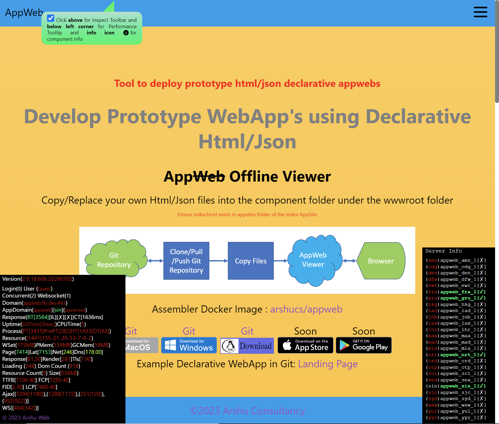

# Deploy Fly Machines in Bulk by configuring in Json

Create/Update/Stop/Start/Destroy Multiple Machines in FLY by configuring in Json

 "Deployed 26 Fly Machines in all Fly Regions".

# Prerequisites after installing FlyCtl from https://fly.io/docs/hands-on/install-flyctl/ and doing the below

Ensure the API Token is filled in the App Configuration. 

Ensure you have setup a Wireguard Connection to the Fly Network as Documented in https://fly.io/docs/machines/working-with-machines/

<pre>

    //Retrieve the Api Token after Login (To be filled in the App Config)
    flyctl auth token

    //Create a App for Fly Machines
    flyctl apps create --machines --name appweb --org personal

    //Allocate ipV6 for the Fly Machines App
    flyctl ips allocate-v6 --app appweb

    //Allocate ipV4 for the Fly Machines App
    flyctl ips allocate-v4 --app appweb

    //Deploy the docker to the App
    flyctl deploy . --build-only --remote-only --push --image-label latest -a appweb

</pre>

# Manual Creation of Machines (Optional)

<pre>

flyctl machine run registry.fly.io/appweb:latest --name appweb_sin_1 --port 443:8080/tcp:tls --port 80:8080/tcp:http --env IDLE_TIME_IN_SEC="30" --env IDLE_TIME_IN_SEC="30" --env LOAD_APPDATA="true" --env LOAD_MMF_URLS="true" --app appweb --region sin

</pre>

# Verify successfully Start of App

<pre>
    start chrome.exe --auto-open-devtools-for-tabs https://appweb.fly.dev
</pre>

# Bulk Configuration for using the FlyDeployTool

    Multiple Configuration can be enabled/disabled

<pre>

{
  "ProcessList": [
    {
      "ConfigPath": "process_appsample.json",
      "Process": true
    }
  ]
}

</pre>

    Each App Configuration can be further customized.

    ### Fill the API Token in the Json

<pre>

{
  "ApiUser": "",
  "ApiToken": "",
  "OrgName": "personal",
  "AppName": "appweb",
  "ActionInterval": 1000,
  "MachineConfig": [
    {
      "DockerImage": "registry.fly.io/appweb:latest",
      "Action": "CreateOrUpdate",
      "ActionHelp": "Action Values are | Stop | Delete | Destroy | Create | Update | CreateOrUpdate",
      "ActionType": "Direct",
      "ActionTypeHelp": "Action Type Values are Direct | Rollup (Create New, Destroy Old) (Valid only for Action Update)",
      "MachineCreateTemplate": "machine_create.json",
      "MachineUpdateTemplate": "machine_update.json",
      "EnvConfig": [
        {
          "EnvName": "INITIAL_TIME_IN_SEC",
          "EnvValue": "30"
        },
        {
          "EnvName": "IDLE_TIME_IN_SEC",
          "EnvValue": "30"
        }
      ]
    }
  ],
  "RegionConfig": [
    {
      "RegionCode": "sin",
      "Process": true
    },
    {
      "RegionCode": "ams",
      "Process": false
    },
    {
      "RegionCode": "cdg",
      "Process": false
    },
    {
      "RegionCode": "den",
      "Process": false
    },
    {
      "RegionCode": "dfw",
      "Process": false
    },
    {
      "RegionCode": "ewr",
      "Process": false
    },
    {
      "RegionCode": "fra",
      "Process": false
    },
    {
      "RegionCode": "gru",
      "Process": false
    },
    {
      "RegionCode": "hkg",
      "Process": false
    },
    {
      "RegionCode": "iad",
      "Process": false
    },
    {
      "RegionCode": "jnb",
      "Process": false
    },
    {
      "RegionCode": "lax",
      "Process": false
    },
    {
      "RegionCode": "lhr",
      "Process": false
    },
    {
      "RegionCode": "maa",
      "Process": false
    },
    {
      "RegionCode": "mad",
      "Process": false
    },
    {
      "RegionCode": "mia",
      "Process": false
    },
    {
      "RegionCode": "nrt",
      "Process": false
    },
    {
      "RegionCode": "ord",
      "Process": false
    },
    {
      "RegionCode": "otp",
      "Process": false
    },
    {
      "RegionCode": "scl",
      "Process": false
    },
    {
      "RegionCode": "sea",
      "Process": false
    },
    {
      "RegionCode": "sjc",
      "Process": false
    },
    {
      "RegionCode": "syd",
      "Process": false
    },
    {
      "RegionCode": "waw",
      "Process": false
    },
    {
      "RegionCode": "yul",
      "Process": false
    },
    {
      "RegionCode": "yyz",
      "Process": false
    }
  ],
}

</pre>
